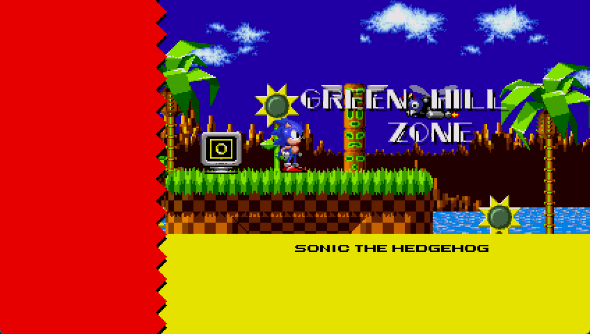

# Sonic Hybrid Ultimate

Aims to mix different Sonic the Hedgehog games into a single big game. Acts as a legal but cheaper version of Sonic Origins for fans that don't want to get scammed.



## 🎮 What You Get

Sonic Hybrid Ultimate merges **Sonic 1**, **Sonic CD**, and **Sonic 2** into a single continuous adventure:
- Start with Green Hill Zone (Sonic 1)
- Seamlessly transition to Palmtree Panic (Sonic CD)  
- Continue to Emerald Hill Zone (Sonic 2)
- Play through to Death Egg Zone!

All three games flow together with custom transitions and unified progression.

## 📦 What You Need

To build and play Sonic Hybrid Ultimate, you need:

### 1. Build Tools
- CMake 3.15 or later
- C++ compiler (GCC, Clang, or MSVC)
- .NET 6.0 SDK or later
- Git with submodules support

### 2. Game Data Files (Legally Obtained)

Place these files in `Hybrid-RSDK-Main/rsdk-source-data/`:
- **`soniccd.rsdk`** - From Sonic CD (2011 remaster) 
- **`sonic1.rsdk`** - From Sonic the Hedgehog (2013 mobile remaster)
- **`sonic2.rsdk`** - From Sonic the Hedgehog 2 (2013 mobile remaster)

Get these from:
- iOS App Store / Google Play Store (mobile versions)
- Steam (Sonic CD)

⚠️ **Copyright Notice**: Game data files cannot be distributed with this project. You must obtain them legally.

See `Hybrid-RSDK-Main/rsdk-source-data/README.md` for detailed instructions.

### 3. Optional: Sonic 3 & Knuckles Support

For Sonic 3 & Knuckles (separate from the hybrid experience):
- Download [Sonic 3 AIR](https://sonic3air.org/)
- Extract to `Sonic 3 AIR Main` folder
- Provide your legally obtained `sonic3.bin` ROM
- See [SONIC3_AIR_SETUP.md](SONIC3_AIR_SETUP.md) for setup

## 🏗️ How It Works

Sonic Hybrid Ultimate has three main components:

### 1. Hybrid RSDK (Sonic 1 + CD + 2)
- **Build Tools** (C#): Unpack, convert, and merge the three games
- **RSDKv4 Engine** (C++): Runs the unified hybrid experience
- **Output**: Single `Data.rsdk` file containing all three games

### 2. Sonic 3 AIR (Sonic 3 & Knuckles)
- **Oxygen Engine**: Separate engine for Sonic 3 & Knuckles
- Runs independently from RSDK games
- Uses ROM hacking approach

### 3. Custom Client (Frontend)
- **Launcher Application**: Manages game selection
- Can launch hybrid mode or individual games
- Switches between engines as needed

## 🚀 Quick Start

### Linux/macOS

```bash
# Clone the repository
git clone https://github.com/yourusername/Sonic-Hybrid-Ultimate.git
cd Sonic-Hybrid-Ultimate

# Place game files (see "What You Need" above)
# Put soniccd.rsdk, sonic1.rsdk, sonic2.rsdk in Hybrid-RSDK-Main/rsdk-source-data/

# Build everything
chmod +x build_all.sh
./build_all.sh

# Play the hybrid experience
cd Hybrid-RSDK-Main/sonic-hybrid
./run_hybrid.sh
```

### Windows

```cmd
REM Clone the repository
git clone https://github.com/yourusername/Sonic-Hybrid-Ultimate.git
cd Sonic-Hybrid-Ultimate

REM Place game files (see "What You Need" above)
REM Put soniccd.rsdk, sonic1.rsdk, sonic2.rsdk in Hybrid-RSDK-Main\rsdk-source-data\

REM Build everything (requires vcpkg for dependencies)
powershell -ExecutionPolicy Bypass -File build_all.ps1

REM Play the hybrid experience
cd Hybrid-RSDK-Main\sonic-hybrid
run_hybrid.bat
```

## 📊 Completion Status

- ✅ **RSDKv4 Engine**: Fully working with Team Forever enhancements
- ✅ **Build Tools**: C# unpacking and generation tools integrated
- ✅ **Hybrid Data Generation**: Automated in build process
- ✅ **Custom Client**: Framework complete, multi-engine support
- 🔄 **Sonic 3 AIR Integration**: Source code present, integration in progress
- 🔄 **Full Game Flow**: Testing transitions between games

Sonic Hybrid RSDK plus the Decompilations of RSDK Versions 3, 4 and/or 5U

And a seperate Frontend for managing both.

The Frontend will oversee and run both parts seperately, after Sonic 2 ends, the Frontend begins launching Sonic 3 and Knuckles via Sonic 3 AIR, sort of like switching HDMI inputs from one device to another on a TV.

## Completion Status:
Hybrid-RSDK Debugging/Additons ?% (Hybrid-RSDK is still broken)

Sonic 3 AIR (Oxygen) Integration 50% (All the source code is in the repo, but we havent done the neccessary changes yet)
Integration with Hybrid-RSDK-Main is in progress, focusing on resolving loading issues and graphical corruption.

Custom-Client 0% (debugging Hybrid-RSDK-Main is the priority)

## Build Process

⚠️ **IMPORTANT**: If you're experiencing crashes when loading games, see [CRASH_FIX_README.md](CRASH_FIX_README.md) for detailed troubleshooting steps.

📋 **SONIC 3 & KNUCKLES SETUP**: For Sonic 3 & Knuckles support, see [SONIC3_AIR_SETUP.md](SONIC3_AIR_SETUP.md) for complete setup instructions.

### Quick Start (Fix Crashes)

If the application crashes when loading .rsdk or .bin files:

**Windows:**
```batch
# Double-click build_native_libs.bat, or run:
build_native_libs.bat
```

**Linux/macOS:**
```bash
chmod +x build_native_libs.sh
./build_native_libs.sh
```

Then build and run the C# application:
```bash
cd Custom-Client
dotnet build
dotnet run
```

### Prerequisites
- CMake 3.15 or higher
- C++17 compatible compiler
- .NET 6.0 SDK
- Git with submodule support

### Dependencies (Linux/Ubuntu)
```bash
sudo apt-get update
sudo apt-get install -y cmake build-essential pkg-config libsdl2-dev libgl1-mesa-dev libglew-dev libvorbis-dev libtinyxml2-dev libtheora-dev libogg-dev
```

### Build Instructions

1. Clone the repository with submodules:
```bash
git clone --recursive https://github.com/Badgerworks-Brewery/Sonic-Hybrid-Ultimate.git
cd Sonic-Hybrid-Ultimate
```

2. Apply Team Forever enhancements:
```bash
chmod +x apply_teamforever.sh
./apply_teamforever.sh
```

3. Fetch RSDK decompilations:
```bash
chmod +x fetch_rsdkv3.sh fetch_rsdkv4.sh fetch_rsdkv5.sh
./fetch_rsdkv4.sh
./fetch_rsdkv3.sh
./fetch_rsdkv5.sh
```

4. Build the Hybrid-RSDK-Main engine:
```bash
cd "Hybrid-RSDK-Main"
mkdir -p build
cd build
cmake ..
cmake --build .
cd ../..
```

5. Build the Custom-Client:
```bash
cd "Custom-Client"
dotnet build
cd ..
```

6. Put the required game data files in `Hybrid-RSDK-Main/rsdk-source-data/`:
   - `Data.rsdk` from Sonic CD as `soniccd.rsdk`
   - `Data.rsdk` from Sonic 1 as `sonic1.rsdk`
   - `Data.rsdk` from Sonic 2 as `sonic2.rsdk`
   - `Rom.bin` from Sonic 3&K as `sonic3.bin`

6. Run the executable and have fun!

## Perform an update

This guide is useful if you previously played Sonic Hybrid but you want to perform an update. Please look at the [commit list](https://github.com/Badgerworks-Brewery/Sonic-Hybrid-Ultimate/commits/main) to know more info about the changelog through each update.

1. Pull the latest changes:
```bash
git pull --recurse-submodules
```

2. Update RSDK decompilations:
```bash
./fetch_rsdkv4.sh
./fetch_rsdkv3.sh
./fetch_rsdkv5.sh
```

3. Rebuild the project following steps 3-4 from the build instructions above.

## Features

* Play Sonic 1, Sonic CD, Sonic 2 and Sonic 3&k a single big game.
* Star Posts in Sonic the Hedgehog 1 and CD will bring you to the Sonic the Hedgehog 2 special stages.
* Completing Sonic the Hedgehog 1's Final Zone will bring you to Palmtree Panic Zone.
* Completing Sonic the Hedgehog CD's Metallic Madness Act 3 will bring you to Emerald Hill Zone.
* Completing Death Egg Zone in Sonic the Hedgehog 2 will bring you to Angel Island Zone.
* The Stage Select in the debug menu will report all the implemented level names.
* Sonic CD stages correctly transitions as the original game.
* Metal Sonic is now a playable character.
* Sonic 3 will be included.

## Known issues
* **It runs, but when you load a level  it only loads the background**
* No Sonic 3 yet.
* Sonic 1 Special Stages are working from the Stage Select, but the graphics is corrupted.
* The main menu of RSDK will report the wrong stage names.
* The Giant Ring from Sonic the Hedgehog 1 will teleport to the Sonic the Hedgehog 2 special stages.
* Collision Chaos and Stardust Speedway are half-implemented.
* Tidal Tempest, Quartz Quadrant, Wacky Workbench and Metallic Madness are barely implemented.
* In Palmtree Panic Zone, the spinner will softlock the player.
* Some Sonic CD's enemies and gimmicks might have the wrong palette.
* Playable Metal Sonic has a "rolling" bugging collision.

## Resources

Xeeynamo has written [some notes](rsdkv3-to-rsdkv4.md) on how to convert RSDKv3 scripts to RSDKv4 scripts without modifying the RSDKv4 engine.

Everything contained in `rsdk/Scripts` is a modified version of [Rubberduckycooly's Sonic 1/2 script decompilation](https://github.com/Rubberduckycooly/Sonic-1-Sonic-2-2013-Script-Decompilation). This project would not exist without it.

The function `SonicHybridRsdk.Unpack12/DecryptData` was written by Giuseppe Gatta (nextvolume) from its [Retrun](http://unhaut.epizy.com/retrun/).

## Credits
* Decompilation by Rubberduckycooly.
* Hybrid-RSDK by Xeeynamo.
* Sonic 3 AIR by Eukaryot.
* Main Development By FGSOFTWARE1.

# Open Source Policy

This project is an open-source initiative and welcomes contributions. While the core team manages the primary development and direction, external contributions are highly valued. Key policies include:

* **Contribution Guidelines**: Please read `CONTRIBUTING.md` before submitting pull requests.
* **Code of Conduct**: Adhere to the `CODE_OF_CONDUCT.md` to ensure a positive and inclusive environment.
* **Licensing**: All contributions fall under the project's `LICENSE.md`.
